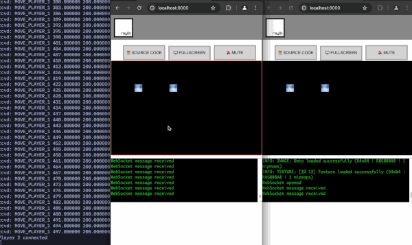

## WebRay

WebRay is an experimental project that works with Raylib in C++, compiles via Emscripten to Webassembly for browser execution, and provides multiplayer client communication through a JavaScript WebSocket server.

To setup and compile, you need to have Raylib and Emscripten installed, bind libraries, and ensure the correct paths are set.

A sample approach is provided in the Makefile.

For more detailed instructions, refer to the following resources:
- [Raylib](https://www.raylib.com)
- [Raylib GitHub](https://github.com/raysan5/raylib)
- [Emscripten](https://emscripten.org)

